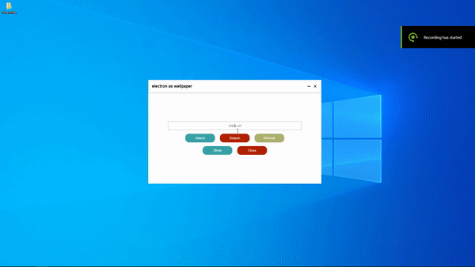

# Electron As Wallpaper (✨)

> set your electron window as wallpaper behind desktop icons

---

<div align="center">


</div>

---

<div align="center">



<a href="https://github.com/meslzy/electron-as-wallpaper/releases/tag/v1.0">`try the app`</a>

</div>

---

## Features (⭐)

- [x] set electron window as wallpaper
- [x] support transparent window
- [x] support mouse forwarding
- [x] support keyboard forwarding

## Getting Started (✅)

- ### Installation (⏬)
    - `npm install electron-as-wallpaper --save`

- ### How to use (🌠)
  ```js
  import {attach, detach, refresh} from "electron-as-wallpaper";
  // or
  const {attach, detach, refresh} = require("electron-as-wallpaper");
  
  attach(mainWindow);
  detach(mainWindow);
  
  // if the window closed before detach, you can call refresh
  refresh();
  ```

- ### Examples
    - [transparent](exmaples/transparent/index.js)
    - [input forwarding](exmaples/input-forwarding/index.js)
    - [screen size changed](exmaples/screen-size-changed/index.js)

---

## The End (💘)
